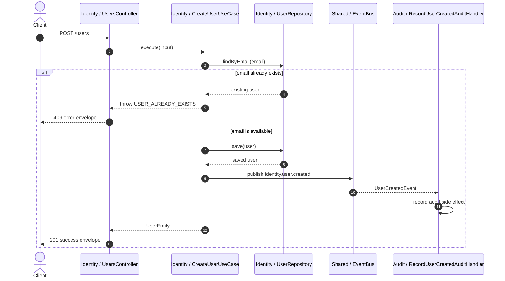
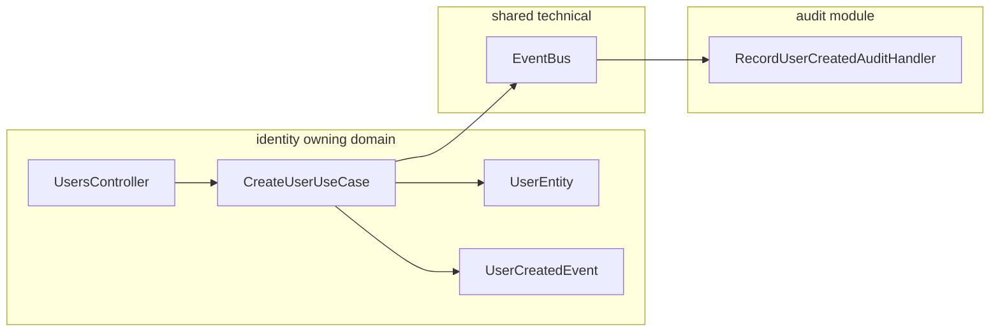

# NTSI Nest Boilerplate

Boilerplate สำหรับสร้าง backend ด้วย NestJS โดยตั้งใจให้เริ่มจาก **modular monolith** ก่อน แต่จัด boundary ให้ชัดพอที่จะ extract บาง module ออกไปเป็น microservice ได้ในอนาคต

แนวคิดหลักของ project นี้คือ:

- module เป็นเจ้าของ business domain และ persistence ของตัวเอง
- entity อยู่ใน module เจ้าของ ไม่รวมไว้กลาง
- module อื่นห้าม import ข้ามเข้าไปใน `domain` หรือ `infrastructure`
- การคุยข้าม module ต้องผ่าน public API หรือ event
- database object อยู่ภายใต้ owning domain ที่รับผิดชอบ

## Stack

- NestJS
- TypeScript
- Postgres
- TypeORM
- class-validator / class-transformer
- Swagger / OpenAPI
- Jest
- ESLint + Prettier
- Docker multi-stage build

## Project Structure

```txt
src/
  app.module.ts
  main.ts
  configs/
    typeorm.config.ts
  migrations/
    1783400000000-create-identity-users.ts
  modules/
    index.ts
    identity/
      identity.module.ts
      index.ts
      presentation/
        controllers/
        dtos/
      application/
        identity.facade.ts
        use-cases/
      domain/
        entities/
        errors/
        repositories/
      infrastructure/
        persistence/
```

## Module Structure

แต่ละ module ใช้ folder ตาม responsibility ไม่ใช่ตาม Nest artifact แบบ `controllers/services/dtos/entities` เป็น top-level

```txt
src/modules/{module-name}/
  {module-name}.module.ts
  index.ts
  presentation/
  application/
  domain/
  infrastructure/
```

เหตุผลคือ boilerplate นี้ไม่ได้ optimize แค่ CRUD เร็ว แต่ต้องการให้ module boundary อ่านออก, test ง่าย, และย้ายออกไปเป็น service ได้ง่ายขึ้น

## Folder Responsibilities

### `presentation`

ชั้นที่รับ request และแปลง response ออกไปให้ client

ใส่ของพวกนี้:

- controllers
- request DTOs
- response DTOs
- Swagger decorators
- validation decorators เช่น `@IsString()`, `@IsEmail()`, `@IsBoolean()`

ตัวอย่าง:

```txt
presentation/
  controllers/users.controller.ts
  dtos/create-user.request.dto.ts
  dtos/user.response.dto.ts
```

Controller ควรบาง ทำหน้าที่รับ input, เรียก use case, map error เป็น HTTP exception และ return response DTO

### `application`

ชั้นที่อธิบาย workflow ของระบบ หรือสิ่งที่ user/system ต้องการทำ

ใส่ของพวกนี้:

- use cases
- application services
- facades ที่ export ให้ module อื่นเรียก
- command/query handlers ถ้าเพิ่ม CQRS ภายหลัง

ตัวอย่าง:

```txt
application/
  identity.facade.ts
  use-cases/create-user.use-case.ts
  use-cases/get-user.use-case.ts
```

### `domain`

ชั้นของ business concept ที่ module นี้เป็นเจ้าของ

ใส่ของพวกนี้:

- entities
- value objects
- domain errors
- domain events
- repository interfaces/ports
- domain services เฉพาะกรณีที่ rule ไม่ได้อยู่ใน entity ตัวเดียว

ตัวอย่าง:

```txt
domain/
  entities/user.entity.ts
  errors/user-already-exists.error.ts
  repositories/user.repository.ts
```

Entity อยู่ตรงนี้เพราะถือว่าเป็น persistence model ที่ผูกกับ owning domain ของ module นั้น ห้ามย้ายไปรวมไว้ `src/entities`

### `infrastructure`

ชั้น implementation ที่คุยกับโลกภายนอก

ใส่ของพวกนี้:

- TypeORM repository implementation
- external API adapter
- message broker adapter
- file storage adapter
- cache adapter

ตัวอย่าง:

```txt
infrastructure/
  persistence/typeorm-user.repository.ts
```

`domain` อาจประกาศ interface ว่าอยาก save/find user อย่างไร ส่วน `infrastructure` เป็นคนบอกว่าทำจริงด้วย TypeORM/Postgres อย่างไร

## Use Case คืออะไร

Use case คือ class ที่แทน action หนึ่งของระบบ เช่น `CreateUserUseCase`, `GetUserUseCase`, `MarkInvoiceAsPaidUseCase`

วิธีคิด:

- ถ้าเป็นสิ่งที่ user หรือระบบภายนอกสั่งให้ application ทำได้ ให้เป็น use case
- use case หนึ่งควรมีเป้าหมายชัดเจน
- use case คุม workflow, validation เชิง business, transaction boundary และเรียก repository/facade ที่จำเป็น
- controller ไม่ควรมี business workflow เอง

ตัวอย่าง:

```ts
@Injectable()
export class CreateUserUseCase {
  constructor(private readonly users: UserRepository) {}

  async execute(input: CreateUserInput): Promise<UserEntity> {
    const normalizedEmail = input.email.toLowerCase();
    const existingUser = await this.users.findByEmail(normalizedEmail);

    if (existingUser) {
      throw new UserAlreadyExistsError(normalizedEmail);
    }

    return this.users.save(
      UserEntity.create({
        ...input,
        email: normalizedEmail,
      }),
    );
  }
}
```

ตัวอย่างการตัดสินใจ:

- `POST /users` ไม่ควรสร้าง user ใน controller โดยตรง
- controller เรียก `CreateUserUseCase`
- use case เช็ค email ซ้ำและสร้าง entity
- repository implementation เป็นเรื่องของ infrastructure

## Public API ของ Module

แต่ละ module ต้องมี public API ชัดเจนผ่าน `index.ts`

ตัวอย่าง:

```ts
export { IdentityModule } from './identity.module';
export { IdentityFacade } from './application/identity.facade';
```

Module อื่น import ได้เฉพาะของที่ module เจ้าของตั้งใจ export

ทำได้:

```ts
import { IdentityFacade } from '../identity';
```

ห้าม:

```ts
import { UserEntity } from '../identity/domain/entities/user.entity';
import { TypeOrmUserRepository } from '../identity/infrastructure/persistence/typeorm-user.repository';
```

เหตุผลคือถ้า module อื่นรู้จัก entity/repository ภายในของ `identity` มากเกินไป วันหนึ่งจะ extract `identity` ออกไปเป็น service ได้ยาก

## Cross-Module Communication

ใช้ hybrid approach:

- ถ้าต้องการคำตอบทันที ให้เรียกผ่าน facade ของ module เจ้าของ
- ถ้าเป็น side effect หรือ reaction ข้าม module ให้ใช้ event

ตัวอย่าง synchronous:

```ts
@Injectable()
export class CreateOrderUseCase {
  constructor(private readonly identity: IdentityFacade) {}

  async execute(input: CreateOrderInput): Promise<void> {
    await this.identity.assertUserExists(input.userId);
    // create order
  }
}
```

ตัวอย่าง event:

```ts
export class UserCreatedEvent implements DomainEvent<UserCreatedPayload> {
  static readonly eventName = 'identity.user.created';

  readonly name = UserCreatedEvent.eventName;
  readonly occurredAt = new Date();

  constructor(readonly payload: UserCreatedPayload) {}
}
```

ใช้ facade เมื่อ business flow ต้องรู้ผลทันที ใช้ event เมื่อ module อื่นแค่ต้อง react ต่อ

## Domain Event Best Practice

Event ใน boilerplate นี้หมายถึง **fact ที่เกิดขึ้นแล้ว** ไม่ใช่ command ที่สั่งให้ใครไปทำอะไร

ชื่อ event ที่ดี:

```txt
identity.user.created
invoice.paid
organization.suspended
```

ชื่อ event ที่ไม่ดี:

```txt
create.user
send.email.now
check.permission
```

เหตุผล: event ควรบอกว่าเกิดอะไรขึ้นแล้ว ส่วนใครจะ react อย่างไรเป็นเรื่องของ consumer

### ใช้ Event เมื่อไหร่

ใช้ event เมื่อ:

- module อื่นต้อง react หลัง state change
- งานนั้นเป็น side effect
- caller ไม่ต้องรอผลลัพธ์เพื่อจบ operation
- ความสัมพันธ์เป็น eventual consistency ได้
- ต้องการลด coupling ระหว่าง module

ตัวอย่างที่เหมาะ:

```txt
identity สร้าง user สำเร็จ
  -> publish UserCreatedEvent
audit รับ event
  -> record audit log
notification รับ event
  -> ส่ง welcome email
```

### ไม่ควรใช้ Event เมื่อไหร่

ไม่ควรใช้ event เมื่อ:

- caller ต้องการคำตอบทันที
- caller ต้อง fail ถ้าอีก module ตอบว่าไม่ได้
- เป็น query เช่น get user profile
- เป็น permission check
- ใช้ event เพื่อเลี่ยงการออกแบบ facade

ตัวอย่างที่ไม่ควรใช้ event:

```txt
orders ต้องรู้ว่า user สั่งซื้อได้ไหม
```

กรณีนี้ควรใช้ facade:

```ts
await this.identity.assertUserExists(input.userId);
```

ไม่ใช่ publish event แล้วหวังว่า module อื่นจะตอบกลับ

### Event Payload

Event payload ควรเล็กและ stable

ดี:

```ts
new UserCreatedEvent({
  userId: user.id,
  email: user.email,
});
```

ไม่ดี:

```ts
new UserCreatedEvent({
  user,
  repository,
  requestDto,
});
```

กฎ:

- ใส่ ID และ fact ที่ consumer ต้องใช้จริง
- ไม่ใส่ TypeORM entity ทั้งก้อน
- ไม่ใส่ repository/service/request object
- ไม่ให้ consumer แก้ state ของ publisher ตรง ๆ
- consumer import event contract ผ่าน public API ของ module เจ้าของเท่านั้น

ใน project นี้ `identity` publish `UserCreatedEvent` และ `audit` consume event เพื่อแสดงตัวอย่าง cross-module side effect แบบไม่ import internal ของ identity

Consumer ต้อง import event ผ่าน public API:

```ts
import { UserCreatedEvent } from '../../../identity';
```

ไม่ใช่:

```ts
import { UserCreatedEvent } from '../../../identity/domain/events/user-created.event';
```

### Mermaid Flow Example

ตัวอย่าง flow ของ `Create User` ที่ใช้ event:



Module view:



### How SA Should Specify Event Flows

เวลา SA เขียน spec ว่า flow นี้ใช้ event ให้เขียนแบบนี้ ไม่ใช่แค่บอกว่า "ยิง event"

```md
## Flow: Create User

### Owner

- Owning domain: Identity
- Use case: CreateUserUseCase
- API: POST /users

### State Change

When a user is created successfully, Identity stores the user in `identity.users`.

### Published Event

- Event name: `identity.user.created`
- Event class: `UserCreatedEvent`
- Published by: Identity
- Published after: user is saved successfully
- Delivery expectation: in-process, best-effort side effect

### Event Payload

| Field | Type | Required | Description |
| --- | --- | --- | --- |
| userId | string UUID | yes | ID of the created user |
| email | string | yes | Normalized user email |

### Consumers

| Consumer | Action | Required for API success? |
| --- | --- | --- |
| Audit | Record user-created audit log | no |
| Notification | Send welcome email | no |

### Failure Behavior

- If user creation fails, do not publish `identity.user.created`.
- If an event consumer fails, the create-user API response should not become failed unless the consumer is explicitly part of the main transaction.
- Consumer failures must be logged and handled by the consumer owner.

### Acceptance Criteria

- Creating a user returns `201` success envelope.
- `identity.user.created` is published exactly after the user is persisted.
- Event payload contains `userId` and normalized `email`.
- Audit consumes the event without importing Identity internals.
- Identity does not call Audit directly.
```

SA checklist:

- ระบุ owning domain
- ระบุ state change ที่เกิดก่อน publish event
- ระบุ event name เป็น fact ที่เกิดแล้ว
- ระบุ payload เป็นตาราง
- ระบุ consumer และ action ของแต่ละ consumer
- ระบุว่า consumer failure กระทบ API success หรือไม่
- ระบุว่า flow นี้ eventual consistency ได้หรือไม่
- ถ้า caller ต้องรอคำตอบ ห้ามใช้ event ให้ใช้ facade แทน

## Shared Rules

`shared` มีได้ แต่ต้องเล็กและไม่ใช่ business domain

อนุญาต:

```txt
shared/
  decorators/
  errors/
  filters/
  guards/
  interceptors/
  pipes/
  types/
  utils/
```

หลีกเลี่ยง:

```txt
shared/entities/
shared/repositories/
shared/services/
shared/dtos/
```

ถ้า concept มี owning domain ให้เก็บไว้ใน module เจ้าของ แล้ว expose ผ่าน facade, event หรือ explicit contract

## Cache

Cache ใน boilerplate นี้เป็น technical shared capability ไม่ใช่ business owner และไม่ใช่ source of truth

เริ่มต้นใช้ Nest local in-memory cache ผ่าน `@nestjs/cache-manager`

```txt
src/shared/cache/
  cache.module.ts
  cache-store.ts
  stores/nest-cache.store.ts
```

Business module ต้อง depend ที่ abstraction:

```ts
constructor(private readonly cache: CacheStore) {}
```

ไม่ควร import cache-manager หรือ Redis client ตรงใน use case

### Cache-Aside Pattern

ตัวอย่างใน `GetUserUseCase`

```ts
const cachedUser = await this.cache.getOrSet(
  IdentityCacheKeys.userById(userId),
  async () => {
    const foundUser = await this.users.findById(userId);

    if (!foundUser) {
      throw new UserNotFoundError(userId);
    }

    return this.toCacheRecord(foundUser);
  },
  { ttlMs: 60_000 },
);
```

แนวคิด:

- read path ลองอ่าน cache ก่อน
- cache miss ค่อยโหลดจาก repository เจ้าของข้อมูล
- หลังโหลดสำเร็จค่อย set cache
- ถ้า cache หาย ระบบต้องยังทำงานได้จาก source of truth

### Cache Key Ownership

Cache key เฉพาะ domain ต้องอยู่ใน module เจ้าของ

```txt
src/modules/identity/application/cache/identity-cache-keys.ts
```

ตัวอย่าง:

```ts
export class IdentityCacheKeys {
  static userById(userId: string): string {
    return `identity:user:${userId}`;
  }
}
```

ห้ามเอา key เฉพาะ business domain ไปไว้ใน `shared/cache`

### Cache Payload

Cache payload ควรเป็น plain serializable record ไม่ใช่ TypeORM entity instance

ดี:

```ts
{
  id: user.id,
  email: user.email,
  createdAt: user.createdAt.toISOString()
}
```

ไม่ดี:

```ts
userEntity
```

เหตุผลคือ local memory cache เก็บ class instance ได้ แต่ Redis จะ serialize/deserialize แล้ว class และ Date อาจไม่เหมือนเดิม

### Invalidation

หลัง state change สำเร็จ ให้ populate หรือ invalidate cache ที่เกี่ยวข้อง

ตัวอย่าง `CreateUserUseCase` สร้าง user สำเร็จแล้ว populate cache:

```ts
await this.cache.set(
  IdentityCacheKeys.userById(user.id),
  userCacheRecord,
  { ttlMs: 60_000 },
);
```

ถ้าวันหลังมี `UpdateUserUseCase` ต้อง invalidate หรือ set ค่าใหม่:

```ts
await this.cache.delete(IdentityCacheKeys.userById(user.id));
```

### เปลี่ยนเป็น Redis ภายหลัง

Use case ไม่ควรเปลี่ยน

เปลี่ยนเฉพาะ implementation/provider ของ `CacheStore` หรือ config ของ `AppCacheModule`

```txt
CacheStore
  -> NestCacheStore local memory ตอนนี้
  -> RedisCacheStore หรือ Redis-backed cache-manager store ในอนาคต
```

กฎ:

- cache ห้ามเป็น source of truth
- module เจ้าของข้อมูลต้องยังโหลดจาก repository/facade ได้เสมอ
- cache key ต้อง namespaced ด้วย owning domain เช่น `identity:user:{id}`
- หลีกเลี่ยง cache ข้อมูลที่เปลี่ยนถี่ ถ้าไม่มี invalidation ชัด
- หลีกเลี่ยง cache permission/security decision นานเกินไป
- TTL default ใช้ `CACHE_TTL_MS`

## Database Rules

ใช้ Postgres + TypeORM และใช้ migration เท่านั้น

ห้ามใช้:

```ts
synchronize: true
```

### Schema by Owning Domain

Table ต้องอยู่ภายใต้ schema ของ owning domain

```txt
identity.users
billing.invoices
billing.invoice_lines
```

เหตุผล:

- เห็น data ownership จาก database
- migration อ่าน ownership ออก
- extract module เป็น service ได้ง่ายขึ้น
- ลดการ query/write ข้าม domain แบบไม่ตั้งใจ

### Naming Convention

Code และ API ใช้ `camelCase`

```ts
firstName: string;
createdAt: Date;
```

Database ใช้ `snake_case`

```txt
first_name
created_at
```

Entity ต้อง map ชัดเจน:

```ts
@Column({ name: 'first_name' })
firstName!: string;

@CreateDateColumn({ name: 'created_at' })
createdAt!: Date;
```

### Constraint and Index Naming

ใช้ owning domain prefix เสมอ

```txt
pk_identity_users
uq_identity_users_email
ix_identity_users_created_at
fk_billing_invoice_lines_invoice_id_invoices
chk_billing_invoices_total_amount_non_negative
```

### Cross-Domain References

ถ้า table หนึ่งต้องอ้าง concept ของอีก owning domain ให้เก็บเป็น scalar ID เท่านั้น ไม่ใช้ TypeORM relation decorator ข้าม domain

ห้าม:

```ts
@ManyToOne(() => UserEntity)
@JoinColumn({ name: 'user_id' })
user!: UserEntity;
```

ให้ใช้:

```ts
@Column({ name: 'user_id', type: 'uuid' })
userId!: string;
```

กฎ:

- อนุญาต TypeORM relation decorator เฉพาะภายใน owning domain เดียวกัน
- ห้าม `@ManyToOne`, `@OneToMany`, `@OneToOne`, `@ManyToMany` ข้าม owning domain
- ห้าม import entity ของ module อื่นเพื่อทำ relation
- default ห้าม DB foreign key ข้าม owning domain
- repository ของ business domain ห้ามซ่อน join ข้าม schema/domain
- ถ้า command ต้องเช็คว่า ID มีจริง ให้เช็คผ่าน facade ของ owning domain
- ถ้า list/report ต้องใช้ข้อมูลหลาย domain ให้ใช้ facade composition, projection หรือ reporting module

ตัวอย่าง `orders` อ้าง `identity`:

```ts
await this.identity.assertUserExists(input.userId);
```

```ts
@Column({ name: 'user_id', type: 'uuid' })
userId!: string;
```

ไม่ทำ:

```sql
FOREIGN KEY (user_id) REFERENCES identity.users(id)
```

ยกเว้น cross-domain FK ได้เฉพาะมี ADR/exception ชัดเจน เช่น immutable shared reference data หรือ domain ที่ตั้งใจไม่ extract

### Reference Snapshot

ถ้าข้อมูลจากอีก domain กลายเป็นส่วนหนึ่งของ historical/business record ให้เก็บ snapshot ได้

ตัวอย่าง invoice:

```ts
@Column({ name: 'customer_id', type: 'uuid' })
customerId!: string;

@Column({ name: 'customer_name_snapshot', type: 'varchar' })
customerNameSnapshot!: string;

@Column({ name: 'customer_tax_id_snapshot', type: 'varchar' })
customerTaxIdSnapshot!: string;
```

กฎ:

- `{concept}Id` คือ reference ไปยัง owning domain อื่น
- `{concept}{Field}Snapshot` คือค่าที่ record นี้ต้องจำ ณ เวลานั้น
- snapshot ไม่ใช่ source of truth ของ domain เจ้าของข้อมูล
- ถ้าต้องการค่าล่าสุด ให้ถาม owner ผ่าน facade/projection
- DB column snapshot ต้อง suffix `_snapshot`

## Migrations

Migration อยู่กลางที่ `src/migrations`

```txt
src/migrations/
  1783400000000-create-identity-users.ts
```

กฎ:

- migration name ต้องมี owning domain เช่น `create-identity-users`
- migration ต้องสร้าง schema เอง เช่น `CREATE SCHEMA IF NOT EXISTS "identity"`
- migration ห้ามแก้ table ของ domain อื่นโดยไม่มีเหตุผลชัด
- auto-generated migration ต้อง review ชื่อ schema, table, column, index และ constraint ทุกครั้ง

คำสั่ง:

```bash
npm run migration:run
npm run migration:revert
```

สำหรับ compiled production build:

```bash
npm run migration:run:prod
npm run migration:revert:prod
```

## Validation and DTOs

Request DTO ใช้ `class-validator`

ตัวอย่าง:

```ts
export class CreateUserRequestDto {
  @IsEmail()
  @MaxLength(320)
  email!: string;

  @IsString()
  @MinLength(1)
  @MaxLength(100)
  firstName!: string;

  @IsString()
  @MinLength(1)
  @MaxLength(100)
  lastName!: string;
}
```

Global validation เปิดใน `src/main.ts`

```ts
app.useGlobalPipes(
  new ValidationPipe({
    transform: true,
    whitelist: true,
    forbidNonWhitelisted: true,
  }),
);
```

ผลคือ:

- field ที่ไม่ได้ประกาศใน DTO จะถูก reject
- input ถูก transform ตาม DTO เท่าที่ Nest/class-transformer รองรับ
- controller ได้ input ที่ผ่าน validation แล้ว

## Response Standard

JSON API ทุก endpoint ใช้ response envelope กลาง

Success response:

```json
{
  "success": true,
  "data": {
    "id": "uuid",
    "email": "user@example.com"
  },
  "meta": {
    "requestId": "8efc77b2-7fd6-4fc8-a31f-eecf397a51d2"
  }
}
```

Controller ไม่ต้อง wrap response เอง ให้ return DTO ปกติ

```ts
@Get(':id')
async getById(@Param('id') id: string): Promise<UserResponseDto> {
  const user = await this.getUser.execute(id);

  return UserResponseDto.fromEntity(user);
}
```

`ApiResponseInterceptor` จะ wrap เป็น envelope ให้เอง

ข้อยกเว้นที่ไม่ควร wrap:

- file download
- stream
- redirect
- health check ที่ตั้งใจให้ raw
- endpoint ที่ตอบ `204 No Content`

## Error Standard

Error response ใช้ envelope กลางเช่นกัน

```json
{
  "success": false,
  "error": {
    "code": "USER_NOT_FOUND",
    "message": "User was not found",
    "details": {
      "userId": "uuid"
    }
  },
  "meta": {
    "requestId": "8efc77b2-7fd6-4fc8-a31f-eecf397a51d2",
    "timestamp": "2026-08-05T10:30:00.000Z",
    "path": "/users/uuid"
  }
}
```

กฎ:

- client ต้องใช้ `error.code` เป็น contract หลัก
- `message` เป็นข้อความอ่านได้ เปลี่ยนได้ ไม่ควรใช้ branch logic
- production ไม่ส่ง stack trace
- HTTP status ยังใช้ตามปกติ เช่น `400`, `404`, `409`, `500`
- controller ไม่ควร try/catch เพื่อ map domain error เอง
- `ApiExceptionFilter` เป็นคน map error เป็น envelope

Domain/application error ควร extend `ApplicationError`

```ts
export class UserNotFoundError extends ApplicationError {
  constructor(userId: string) {
    super({
      code: ErrorCode.UserNotFound,
      message: 'User was not found',
      details: { userId },
    });
  }
}
```

`ApplicationError` ไม่พก HTTP status เพราะ domain/application ไม่ควรรู้ transport detail

Validation error ใช้ shape นี้:

```json
{
  "success": false,
  "error": {
    "code": "VALIDATION_FAILED",
    "message": "Validation failed",
    "details": [
      {
        "field": "email",
        "messages": ["email must be an email"]
      }
    ]
  },
  "meta": {
    "requestId": "req_123",
    "timestamp": "2026-08-05T10:30:00.000Z",
    "path": "/users"
  }
}
```

## Request ID

API ใช้ `x-request-id`

- ถ้า caller ส่ง `x-request-id` มา ให้ใช้ค่านั้น
- ถ้าไม่ส่งมา server จะ generate UUID
- response ต้องส่ง header `x-request-id` กลับเสมอ
- response body ต้องมี `meta.requestId`

## Pagination Response

List endpoint ใช้ `data` เป็น array และใส่ pagination ใน `meta.pagination`

```json
{
  "success": true,
  "data": [],
  "meta": {
    "requestId": "req_123",
    "pagination": {
      "page": 1,
      "perPage": 20,
      "total": 100,
      "totalPages": 5,
      "hasNextPage": true,
      "hasPreviousPage": false
    }
  }
}
```

Public API ใช้ `page/perPage` เป็น default ส่วน repository ภายในจะใช้ `offset/limit` ก็ได้

## Swagger

Swagger UI:

```txt
http://localhost:3000/api/docs
```

OpenAPI JSON:

```txt
http://localhost:3000/api/docs-json
```

ปิด Swagger ได้ด้วย:

```env
SWAGGER_ENABLED=false
```

DTO และ controller ควรใส่ Swagger decorators เพื่อให้ API docs อ่านง่าย

```ts
@ApiTags('Identity')
@Controller('users')
export class UsersController {}
```

```ts
@ApiProperty({ example: 'user@example.com', maxLength: 320 })
email!: string;
```

## Local Development

```bash
npm install
cp .env.example .env
docker compose up -d postgres
npm run migration:run
npm run start:dev
```

Application:

```txt
http://localhost:3000
```

Swagger:

```txt
http://localhost:3000/api/docs
```

## Docker

Build image:

```bash
docker build -t nest-ntsi-boilerplate .
```

Run container:

```bash
docker run --rm -p 3000:3000 --env-file .env nest-ntsi-boilerplate
```

Dockerfile ใช้ multi-stage build:

```txt
deps      install dependencies ทั้งหมดสำหรับ build
build     compile TypeScript เป็น dist
prod-deps install production dependencies เท่านั้น
runner    copy dist + production node_modules แล้วรันด้วย non-root user
```

## Commands

```bash
npm run build
npm run lint
npm run format
npm test
npm run test:e2e
npm run migration:run
npm run migration:revert
npm run migration:run:prod
npm run migration:revert:prod
```

## How to Add a New Module

สมมติจะเพิ่ม `billing`

สร้าง structure:

```txt
src/modules/billing/
  billing.module.ts
  index.ts
  presentation/
    controllers/
    dtos/
  application/
    billing.facade.ts
    use-cases/
  domain/
    entities/
    errors/
    repositories/
  infrastructure/
    persistence/
```

วิธีคิด:

1. นิยามก่อนว่า `billing` เป็นเจ้าของ concept อะไร เช่น `Invoice`, `InvoiceLine`
2. วาง entity ไว้ใน `billing/domain/entities`
3. วาง repository interface ไว้ใน `billing/domain/repositories`
4. วาง TypeORM implementation ไว้ใน `billing/infrastructure/persistence`
5. วาง use case ตาม action จริง เช่น `CreateInvoiceUseCase`, `MarkInvoiceAsPaidUseCase`
6. วาง controller/DTO ไว้ใน `billing/presentation`
7. export เฉพาะ public API ผ่าน `billing/index.ts`
8. เพิ่ม migration ที่สร้าง schema/table ภายใต้ `billing`

ห้ามเริ่มจากการสร้าง `services` รวมทุกอย่างก่อน เพราะจะทำให้ business workflow, DB access และ HTTP concern ปนกันเร็ว

## Architecture Decisions

Architecture decisions อยู่ใน `docs/adr`

อ่านตามลำดับ:

- `0001-module-boundaries-and-entity-ownership.md`
- `0002-module-internal-structure.md`
- `0003-cross-module-communication.md`
- `0004-shared-kernel-limits.md`
- `0005-database-schema-by-owning-domain.md`
- `0006-code-and-database-naming.md`
- `0007-postgres-typeorm-migrations.md`
- `0008-central-migrations-with-domain-prefixes.md`
- `0009-database-object-naming.md`
- `0020-cross-domain-orm-relations.md`
- `0021-no-cross-domain-foreign-keys-by-default.md`
- `0022-cross-domain-reference-validation.md`
- `0023-cross-domain-read-models.md`
- `0024-cross-domain-reference-snapshots.md`
- `0025-cross-domain-reference-naming.md`
- `0026-cross-domain-reference-enforcement.md`
- `0027-cache-store-abstraction.md`

Glossary ของ project อยู่ใน `CONTEXT.md`

## AI Agent Instructions

AI coding agents should read `AGENTS.md` before changing this repository. That file contains the enforceable rules for module boundaries, folder responsibilities, DTO validation, database naming, migrations, Swagger, Docker, and verification commands.
